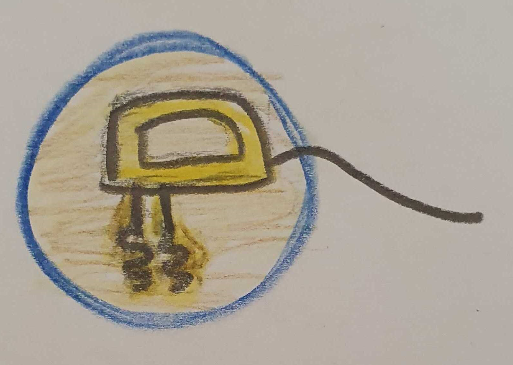
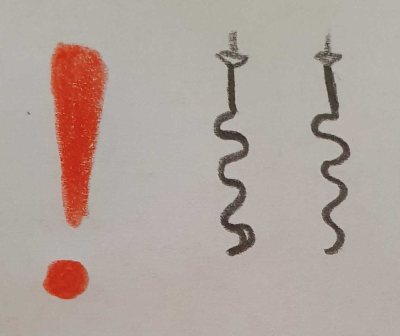
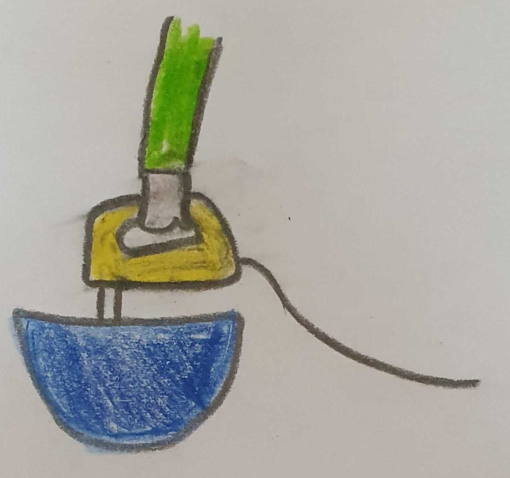

## Hunger? Dann lasst uns los legen!

Egal ob spätabends oder kurz vor der Mittagessenszeit - Kochen geht immer. Und Essen auch. Hier sind eigentlich nur minimale Rezepte versammelt, aber ab und zu muss man auch mal länger dran arbeiten. Oder extra einkaufen gehen :scream_cat:
### Extrem Schnell

#### Grießbrei

### Schnell

#### Roh gebratene Kartoffelwürfel

#### Backofenpommes

#### Buletten (heikel, das für Berlin zu veröffentlichen)

### Nicht ganz so schnell

#### Spätzle

Wenn es so am Rührer aussieht, seid Ihr am Ziel:

Ganz wichtig: Knethaken statt Rührer

Je länger Ihr rührt, umso besser werden die Spätzle

#### Kartoffelklöße

#### Supermarmor

